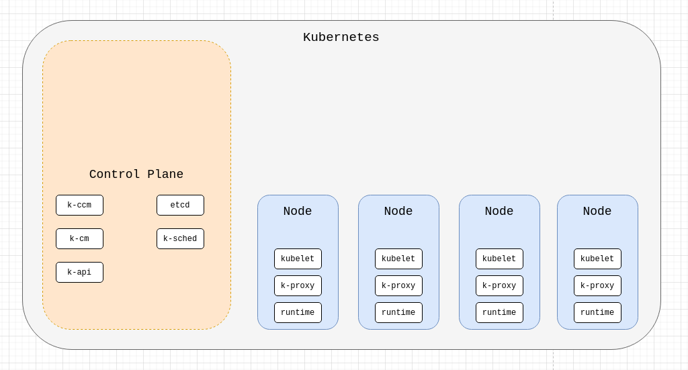

## Kubernetes
### Arquitetura


#### Componentes
- etcd - é o banco onde o k8s guarda os dados, como por exemplo informações sobre as aplicações rodando dentro do cluster
- kube-scheduler - observa os Pods recém criados e não associados a um Node e seleciona um Node para rodar
- kube-apiserver - é um componente que expõe a API do Kubernetes. Valida e configura os dados dos componentes da api, como por exemplo Pods, Services e Replication
- kube-controller-manager - gerencia processos de controlador como por exemplo node-controller, responsável por monitorar e responder quando um Node cai, endpoint-controller que popula os objetos Endpoint (associa Pods com Services) e outros tipos de controladores
- cloud-controller-manager - componente que possui lógica de código de um cloud provider. Por exemplo quando criamos um Service do tipo LoadBalancer, esse componente se encarrega de fazer a chamada da API do provedor para criar o Load Balancer para nós
- kubelet - um agente que roda em cada K8s Node e garante que os containers rodem dentro de Pods
- kube-proxy - é um proxy de rede que roda em cada Node do k8s, e mantém as regras de rede controlando a comunicação da rede
- runtime - software responsável por rodar containers, como por exemplo docker, containerd, e outros que suportam o CRI (container runtime interface)  

### Exemplo app
`kubectl apply -f example-app`

`kubectl expose deployment nginx --port=80 --type=LoadBalancer`

## EKS

### O que é
- É um serviço gerenciado de Kubernetes provido pela AWS
- A AWS gerencia seus master nodes
- Varios apps pré instalados
- Gerencia escala e backups
- Deixamos a plataforma manter a infra para focarmos na aplicação
- Focamos apenas em criar os worker nodes

### Como subir
Existem duas formas de subir: 

1. console da AWS (requer várias configurações - IAM Roles, Security groups, VPC)
- Criar Cluster Control Plane (master nodes): 
    - escolher nome, versão k8s
    - escolher região e VPC
    - configurar segurança
- Criar Worker Nodes e conectar ao cluster:
    - Instancias EC2
    - Node Group (grupo de nodes)
    - define cluster onde será atrelado
    - define security group, tipo da instancia, recursos
    - define min e máx de nodes (autoscaling)
2. eksctl - projeto não oficial da AWS, porém a propria AWS usa em seus treinamentos

## eksctl

### Comando
Profile configurado em ~/.aws/config

`eksctl create cluster --config-file cluster.yaml --profile <aws-profile>`

Com variavel de ambiente

```
export AWS_ACCESS_KEY_ID=<accessKey>
export AWS_ACCESS_SECRET_KEY=<secretKey>
eksctl create cluster --config-file cluster.yaml
```

Confira as permissões necessárias para se criar um cluster EKS: <ref-iam-permissions.md>

### Exemplo

Defina o name, region e version do cluster
```
---
apiVersion: eksctl.io/v1alpha5
kind: ClusterConfig
metadata:
  name: cluster-v1
  region: us-east-1
  version: "1.17"
```

Defina a VPC do cluster
```
vpc:
  id: vpc-0ddd0c4caa8471818
  subnets:
    public:
      public-us-east-1a:
        id: subnet-08dbfdcfeba49417c
      public-us-east-1b:
        id: subnet-0f6be181876f4d9d4
    private:
      private-us-east-1a:
        id: subnet-0cae263741eaaa911
      private-us-east-1b:
        id: subnet-04f1fab8929d40965
```

Defina o(s) nodeGroup(s) para o cluster
- Nome, tipo das instancias, capacidade desejada
```
nodeGroups:
- name: general-v1
  labels:
    role: general
  instanceType: t3.small
  desiredCapacity: 1
  privateNetworking: true
  #ssh:
  #  publicKeyName: treinamento
  subnets:
  - private-us-east-1a
  - private-us-east-1b
```

### Adicionando um novo nodeGroup

1. Adicione no config a especificação do novo nodeGroup
```
- name: spot-v1
  labels:
    role: spot
  minSize: 1
  maxSize: 1
  instancesDistribution:
    instanceTypes:
    - t3.small
    onDemandBaseCapacity: 0
    onDemandPercentageAboveBaseCapacity: 0
    spotInstancePools: 20
  privateNetworking: true
  taints:
    spot: "true:NoSchedule"
  subnets:
  - private-us-east-1a
  - private-us-east-1b
```
2. Atualize o cluster com o seguinte comando
```
eksctl create nodegroup --config-file cluster.yaml
```

### Removendo um nodeGroup
Se for preciso remover um nodeGroup do cluster, remova no yaml e rode o seguinte comando:

`eksctl delete nodegroup --config-file cluster.yaml --only-missing --approve`


### Atualizando um cluster EKS

1. Altere o número da version em cluster.yaml
2. Atualize o Control Plane 
```eksctl update cluster --config-file cluster.yaml```
3. Atualize os core components
- aws-node
    - `eksctl utils update-aws-node --cluster <cluster-name> --profile <aws-profile> --approve`
- coredns
    - `eksctl utils update-coredns --cluster <cluster-name> --profile <aws-profile> --approve`
- kube-proxy
    - `eksctl utils update-kube-proxy --cluster <cluster-name> --profile <aws-profile> --approve`
3. Atualize os worker Nodes
- Managed NodeGroup
        `eksctl update nodegroup --cluster <nome cluster> --name <nome nodeGroup> --kubernetes-version <version>`
- unmanaged NodeGroup
    - adicione uma mesma configuração de nodeGroup com outro nome ex: `nodegroup-v2`
    - aplique a nova configuração: `eksctl create nodegroup --config-file cluster.yaml --approve`
    - remova o nodegroup e aplique no cluster: `eksctl delete nodegroup --config-file cluster.yaml --only-missing --approve`
```
- name: general-v2
  labels:
    role: general
  instanceType: t3.small
  desiredCapacity: 1
  privateNetworking: true
  #ssh:
  #  publicKeyName: treinamento
  subnets:
  - private-us-east-1a
  - private-us-east-1b
  - name: spot-v2
    labels:
      role: spot
    minSize: 1
    maxSize: 1
    instancesDistribution:
      instanceTypes:
      - t3.small
      onDemandBaseCapacity: 0
      onDemandPercentageAboveBaseCapacity: 0
      spotInstancePools: 20
    privateNetworking: true
    taints:
      spot: "true:NoSchedule"
    subnets:
    - private-us-east-1a
    - private-us-east-1b
```