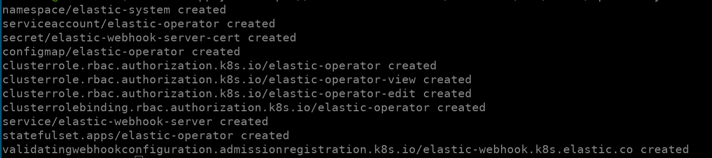

# Elasticsearch

## Definição

- Busca textual e fonetica por relevência
- Não Relacional e Orientado a Documento (json)
- Distribuído (big data)
- Escalável Horizontalmente
- Open-Source
- Schema Free
- Desenvolvido sob o Apache Lucene

## Stack

- Elasticsearch
    - Motor de busca, onde os dados estão armazenados
- Beats
    - Coletores de dados
- Logstash
    - Mais robusto - input, filter, output
- Kibana
    - Ferramenta analitica dos dados

## Configurações
- config/elasticsearch.yml (90%)
- config/jvm.options

## Componentes

- Node
    - Instancia rodando elasticsearch
    - Apenas 1 instancia por servidor
    - Para dev, pode-se subir +1
    - Recomendações
        - Metade da memoria do servidor para heap
        - Não ultrapassar 32Gb de heap
        - Configuração minima e máxima de heap iguais. Xms igual a Xmx
        - Bare Metal
- Cluster
    - 1 ou mais nós compartilhando o mesmo cluster.name
    - Dentro de um cluster os nós possuem funções distintas
        - Master Node
            - Configurações e alterações de cluster
        - Data Node
            - Operações relacionadas a dados
        - Ingest
            - Pré processamentos de dados. Ingest Pipelines, _reindex, etc.
    - Desenvolvimento Local
        - 1 Node
    - Produção (ambientes criticos)
        - Masters Dedicados
        - Datas dedicados
- Indices e Shards
    - Indice
        - Namespace que aponta para um ou mais shards
    - Shard
        - Instancia única do lucene
        - Guarda os dados do índice
        - Tamanho finito (por isso o indice aponta para +1 shard)
        - Cada shard é um motor de busca completo em si
    - Uma busca 'carro', o índice pergunta em cada shard pela palavra chave
    - Clientes não acessam shards diretamente, sempre o índice
    - Pode existir mais de um shard primário em um único nó
- Master Nodes
    - Eleito (através de uma votação)
    - Elegível (pode votar e assume quando falha um eleito)
    - Cluster state (relatorio completo do cluster). Todos recebem uma cópia dele.
    - Split-brain
        - Mais de um master eleito
        - Mais de um nó escrevendo o cluster state
        - Um nó pára de enxergar o outro e se elege Master
    - Recomendações
        - minimum_master_nodes deve ser a metade de master nodes + 1


## Instalação do Elasticsearch em Kubernetes (ECK)

Instale os CRDs (custom resources definition)        
`kubectl create -f https://download.elastic.co/downloads/eck/1.8.0/crds.yaml`

O seguinte comando irá criar os objetos e permissões necessárias para o cluster

`kubectl apply -f https://download.elastic.co/downloads/eck/1.8.0/operator.yaml`



Por fim, suba um elasticsearch cluster

`kubectl apply -f elasticsearch.yaml`

Acompanhe o andamento do cluster

`kubectl -n elastic-system get elasticsearch`

Pegue as credenciais, um usuário `elastic` é automaticamente criado e a senha armazenada em um K8s secret

`PASSWORD=$(kubectl -n elastic-system get secret quickstart-es-elastic-user -o go-template='{{.data.elastic | base64decode}}')`

Faça o port forward para testar o endpoint localmente

`kubectl port-forward service/quickstart-es-http 9200`

`curl -u "elastic:$PASSWORD" -k "https://localhost:9200"`

Você verá uma resposta neste formato:

```{
  "name" : "quickstart-es-default-0",
  "cluster_name" : "quickstart",
  "cluster_uuid" : "7PU8vRLQRNuIDOb-E-1DSg",
  "version" : {
    "number" : "7.15.1",
    "build_flavor" : "default",
    "build_type" : "docker",
    "build_hash" : "83c34f456ae29d60e94d886e455e6a3409bba9ed",
    "build_date" : "2021-10-07T21:56:19.031608185Z",
    "build_snapshot" : false,
    "lucene_version" : "8.9.0",
    "minimum_wire_compatibility_version" : "6.8.0",
    "minimum_index_compatibility_version" : "6.0.0-beta1"
  },
  "tagline" : "You Know, for Search"
}
```

Agora faça o deploy do Kibana

`kubectl apply -f kibana.yaml`

## Instalação do EFK Stack (es, fluentd, kibana)

Com a instalação pronta do ES e Kibana, basta instalar o fluentd.

Neste caso instalaremos via helm chart

```
cd fluentd
helm install --namespace elastic-system fluentd bitnami/fluentd --values values.yaml
```

No helm chart terá vários objetos K8s, onde podemos configurá-lo no arquivo `values.yaml`, mais info em https://github.com/bitnami/charts/tree/master/bitnami/fluentd